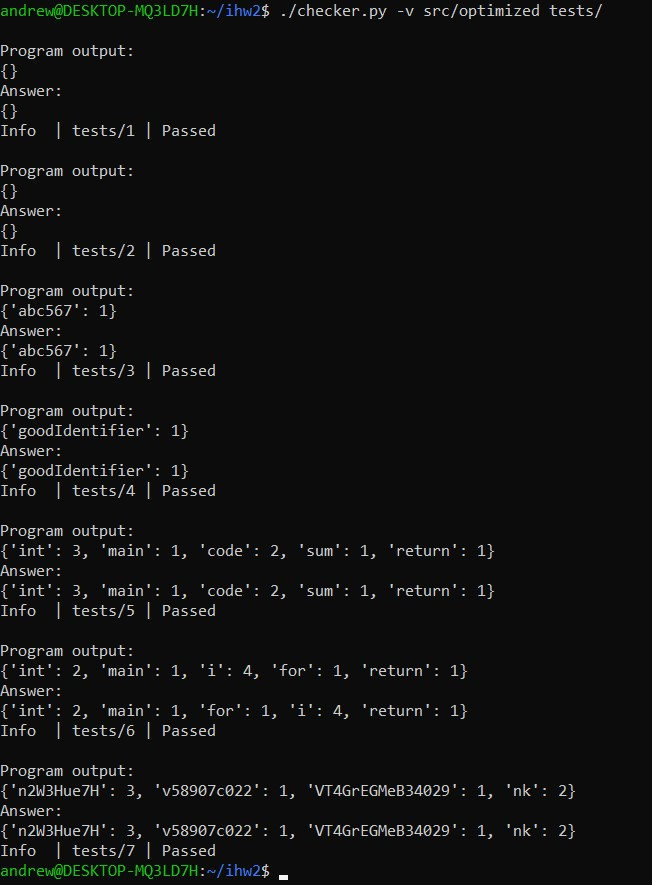
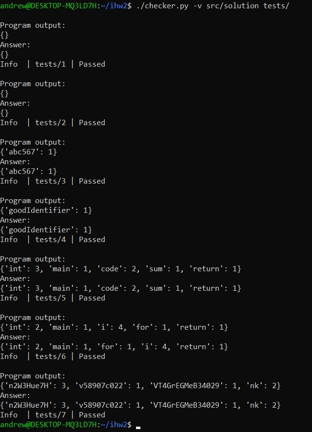
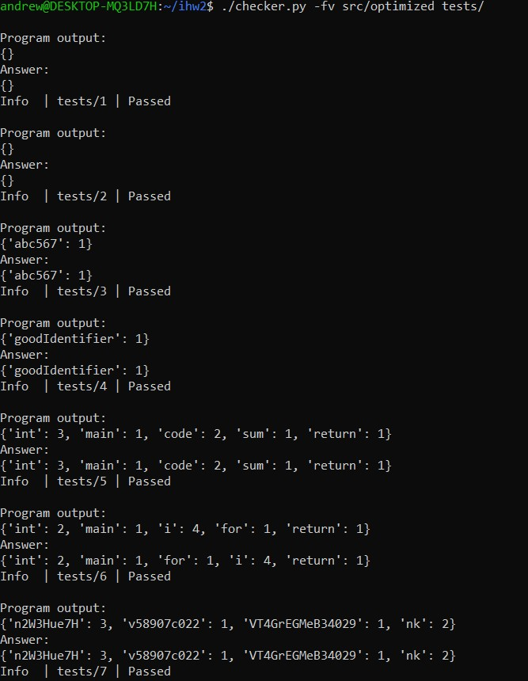
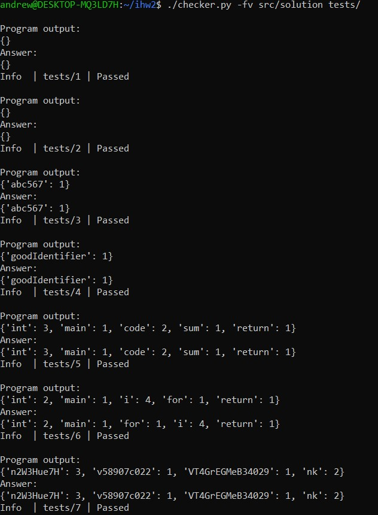
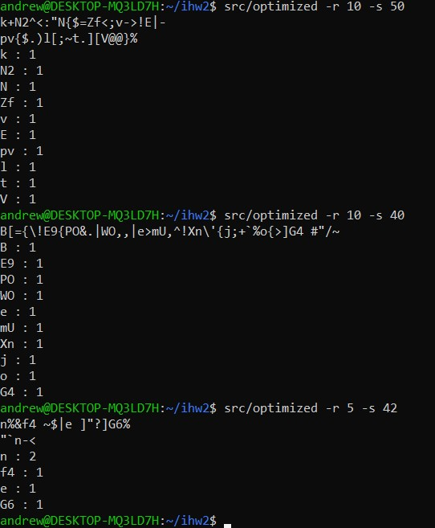
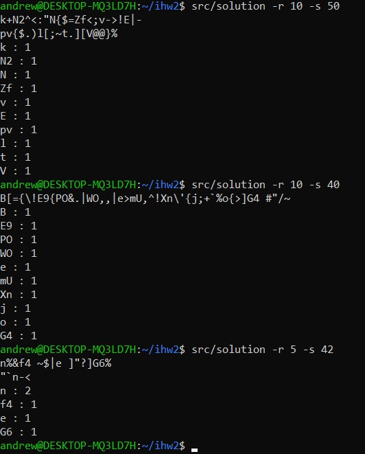

# Индивидуальное домашнее задание №2

#### Студент: Нечесов Андрей Львович
#### Группа: БПИ217
#### Вариант: 25
## Содержание
- [Условие к варианту](#условие-к-варианту)
- [Формат работы программы](#формат-работы-программы)
- [Тестирующий скрипт](#тестирующий-скрипт)
- [Критерии на 4 балла](#критерии-на-4-балла)
	- [Решение на C](#написано-решение-на-c)
	- [Программа на ассемблере](#комментарии-к-программе-на-ассемблере-и-компиляция-программы)
	- [Модификация программы](#из-ассемблерной-программы-убраны-лишние-макросы)
	- [Тестирование программ](#тестирование-программ)
- [Критерии на 5 баллов](#критерии-на-5-баллов)
- [Критерии на 6 баллов](#критерии-на-6-баллов)
	- [Рефакторинг программы на ассемблере](#рефакторинг-программы-на-ассемблере)
	- [Добавление комментариев в разработанную программу](#добавление-комментариев-в-разработанную-программу)
	- [Тестирование полученной программы](#тестирование-полученной-программы)
	- [Сопоставление размеров программ](#сопоставление-размеров-программ)
- [Критерии на 7 баллов](#критерии-на-7-баллов)
	- [Модульная программа](#модульная-программа)
	- [Файловый ввод и вывод](#файловый-ввод-и-вывод)
	- [Файлы для тестирования](#файлы-для-тестирования)
	- [Тестирование файлового ввода/вывода](#тестирование-файлового-вводавывода)
- [Критерии на 8 баллов](#критерии-на-8-баллов)
	- [Генератор случайных наборов данных](#генератор-случайных-наборов-данных)
	- [Замеры времени](#замеры-времени)


## Условие к варианту
>Разработать программу, которая определяет в ASCII-строке частоту встречаемости различных идентификаторов, являющихся словами, состоящими из букв и цифр, начинающихся с буквы. Разделителями являются все другие символы. Для тестирования можно использовать программы, написанные на различных языках программирования.

Вывод идентификаторов и частоты их встречаемости организован в том порядке, в котором идентификаторы встречаются в файле/строке.


## Формат работы программы
```
./solution [-i INPUT_FILE] [-o OUTPUT_FILE] [-s SEED] [-r IDENTIFIERS_N] [-t TESTS_N]
```
`-i INPUT_FILE` указывает на то, что данные нужно читать с файла. В качестве аргумента требуется указать путь ко входному файлу.   
`-o OUTPUT_FILE` указывает на то, что данные нужно выводить в файл. В качестве аргумента опция требуется указать путь к выходному файлу.   
`-r IDENTIFIERS_N` указывает на то, что программа сама должна сгенерировать данные. В качестве аргумента необходимо передать количество идентификаторов. В результате программа генерирует случайный тест с `IDENTIFIERS_N` идентификаторами, выводит сам тест в консоль и ответ на него.  
`-s SEED` семя рандома. В качестве аргумента нужно указать целое число от 1 до 1'000'000.  
`-t TESTS_N` указывает на то, что программа должна провести замер времени работы. В качестве аргумента опции необходимо передать количество тестов для замера времени. В консоль выводится суммарное время затраченное на `TESTS_N` тестов.

## Тестирующий скрипт
Для удобства тестирования программы был написан скрипт [checker.py](checker.py)
```
usage: checker.py [-h] [-f] [-v] path_to_program path_to_tests

Checker for IHW2

positional arguments:
  path_to_program
  path_to_tests

optional arguments:
  -h, --help       show this help message and exit
  -f, --use-files
  -v, --verbose
```

В папке с тестами файлы должны быть именованы следующим образом: \
<Имя файла с тестом> &mdash; сам тест \
<Имя файла с тестом>.a &mdash; ответ на тест

## Критерии на 4 балла
### Написано решение на C
Исходный монолитный код на языке C: [src/solution.c](src/solution.c)
### Комментарии к программе на ассемблере и компиляция программы

Трансформируем код написанный на языке C в язык ассемблера:
```console
gcc -masm=intel -fno-asynchronous-unwind-tables -fno-jump-tables -fno-stack-protector -fno-exceptions solution.c -S -o solution.s
```

Код на языке ассемблера прокомментирован: [src/commented.s](src/commented.s)

Откомпилируем полученную программу без использования отладочных и оптимизируюзих опций:
```console
gcc commented.s -o commented
```
 
### Из ассемблерной программы убраны лишние макросы
Часть работы уже была проделана опциями при трансформации. Теперь руками уберем из ассемблерной программы метаинформацию:
```assembly
	.ident	"GCC: (Ubuntu 9.4.0-1ubuntu1~20.04.1) 9.4.0"
	.section	.note.GNU-stack,"",@progbits
	.section	.note.gnu.property,"a"
	.align 8
	.long	 1f - 0f
	.long	 4f - 1f
	.long	 5
0:
	.string	 "GNU"
1:
	.align 8
	.long	 0xc0000002
	.long	 3f - 2f
2:
	.long	 0x3
3:
	.align 8
4:
```
И следующие команды:  
`endbr64` обеспечивает дополнительную безопасность, но в нашем идеальном мире ИДЗ нет злых хакеров, поэтому удаляем команду.  
`nop` используется для выравнивания, так как подчистили всю метаинформацию, можно тоже удалить.

Итоговая модифицированная программа: [src/reduced.s](src/reduced.s)
### Модифицированная ассемблерная программа отдельно откомпилирована
```console
gcc reduced.s -o reduced
```
### Тестирование программ
Был составлен набор тестов для проверки работы программы на следующих входных данных:
1.	Пустой ввод
2.	Строка с разделителями и цифрами без букв
3.	Один идентификатор в строке
4.	Строка со словами, которые начинаются с цифр, и идентификаторами
5.	Файл №1 на языке С
6.	Файл №2 на языке С
7.	Случайная строка с идентификаторами, два из которых повторяются хотя бы два раза

Все тесты лежат в папке [tests](tests/) и имеют в названии номер соответствующий списку выше.

Используем скрипт [checker.py](checker.py) с опцией `-v` для вывода подробных результатов тестирования:

```console
./checker.py -v src/commented tests/
./checker.py -v src/reduced tests/
```
Получаем одинаковые результаты тестирования для программ:
[commented.s](src/commented.s)            | [reduced.s](src/reduced.s)&nbsp;&nbsp;&nbsp;&nbsp;&nbsp;
:-------------------------:|:-------------------------:
  |  

## Критерии на 5 баллов
Программа на C изначально была написана так, что в ней использовались и локальные переменные, и вызовы функций с передачей параметров. Исходный код на языке ассемблера также содержит требуемые комментарии на оценку 5: [reduced.s](https://github.com/Bopobywek/csa-ihw1/blob/main/src/reduced.s)

## Критерии на 6 баллов
### Рефакторинг программы на ассемблере
В первую очередь оптимизация проводилась для функций, от которых прямо зависит скорость решения задачи: `min`, `isAlpha`, `isAlphaOrNum`, `incrementElement`, `parseIdentifiers`.  

Так, удалось полностью заменить использование стека на регистры в функциях `min`, `isAlpha` и `isAlphaOrNum`. Причем из-за того, что эти функции либо не вызывают никакие другие функции, либо вызывают только друг друга, получилось сократить и количество обменов значений между регистрами. В итоге, эти три функции используют лишь два регистра `rax` и `rdi`.  

В функциях `incrementElement` и `parseIdentifiers` хранение локальных переменных на стеке практически полностью заменено на хранение локальных переменных в регистрах: замена не проводилась только для переменных, которые используются редко. Таким образом, в результате оптимизации были использованы все доступные callee-saved регистры: `rbx`, `r12-r15`. К тому же в прологе функции `incrementElement` значения некоторых регистров сохраняются на стек для частичного соблюдения соглашений по callee-saved регистрам, так как эту функцию вызывает `parseIdentifiers` и в противном случае регистров бы не хватило.

Также использование стека на использование регистров для хранения локальных переменных было заменено (насколько хватило регистров:)) в следующих функциях: `readStringInBuffer`, `writeMapToOutputStream` и `fillBufferRandomly`.

### Добавление комментариев в разработанную программу
Исходный код оптимизированной программы: [optimized.s](src/optimized.s) (прокомментирован)

### Тестирование полученной программы
Для тестирования используем [checker.py](checker.py) и тесты из директории [tests](tests/)

Согласно условию будем сравнивать результаты тестовых прогонов с результатами тестовых прогонов программы на языке C

```console
gcc src/solution.c -o src/solution
gcc src/optimized.s -o src/optimized
```

В первую очередь протестируем консольный ввод/вывод:
```console
./checker.py -v src/optimized tests/
./checker.py -v src/solution tests/
```
[optimized.s](src/optimized.s)            | [solution.c](src/solution.c)&nbsp;&nbsp;
:-------------------------:|:-------------------------:
  |  

Теперь проверим файловый ввод/вывод. Для этого запустим чекер с опцией `-f`:
```console
./checker.py -fv src/optimized tests/
./checker.py -fv src/solution tests/
```
[optimized.s](src/optimized.s)            | [solution.c](src/solution.c)&nbsp;&nbsp;
:-------------------------:|:-------------------------:
  |  

Не забудем проверить, что функции для генерации случайных тестов работают корректно:

[optimized.s](src/optimized.s)            | [solution.c](src/solution.c)&nbsp;&nbsp;
:-------------------------:|:-------------------------:
  |  

Для всех тестовых прогонов получили одинаковый результат.

### Сопоставление размеров программ
Чтобы не учитывать строки с комментариями и прочие нюансы, будем сравнивать размеры исполняемых файлов при помощи утилиты `stat`:

```
cd src
gcc solution.c -o solution
gcc optimized.s -o optimized
stat --printf="size: %s bytes\n" solution
stat --printf="size: %s bytes\n" optimized
```
Получаем следующий результат:
<p align="center">

</p>

Вывод: оптимизированная программа имеет меньший размер, чем программа, полученная после компиляции с языка C => удалась не только оптимизация по скорости (это проверим дальше), но и по размеру :)

## Критерии на 7 баллов
### Модульная программа
Единицы компиляции располагаются в папке [modules](modules/)

Сборка программы:
```
cd modules
make obj
make solution
```

<p align="center">

</p>

### Файловый ввод и вывод
Ввод и вывод в файл осуществляется с помощью опций `-i` и `-o` соответственно:
<p align="center">

</p>

Командная строка проверяется на корректность числа аргументов и корректное открытие файлов:
<p align="center">

</p>

### Файлы для тестирования
Файлы были подготовлены ещё при выполнении критериев на 4 балла:
1.	Пустой ввод
2.	Строка с разделителями и цифрами без букв
3.	Один идентификатор в строке
4.	Строка со словами, которые начинаются с цифр, и идентификаторами
5.	Файл №1 на языке С
6.	Файл №2 на языке С
7.	Случайная строка с идентификаторами, два из которых повторяются хотя бы два раза

Все тесты лежат в папке [tests](tests/) и имеют в названии номер соответствующий списку выше.

### Тестирование файлового ввода/вывода
Снова воспользуемся скриптом [checker.py](checker.py), который умеет тестировать файловый ввод и вывод, и укажем соответствующую опцию `-f`
```console
./checker.py modules/solution tests/
```
<p align="center">

</p>

Программа успешно прошла тесты :)

## Критерии на 8 баллов
### Генератор случайных наборов данных
Для генерации случайного набора данных программу нужно запустить с опцией `-r`, аргументом которой является количество идентификаторов в генерируемом тесте.  

 Причем с опцией `-r` программа специально генерирует небольшие идентификаторы, чтобы вероятность повтора идентификатора была больше.

Приведем пару примеров использования генератора:
```console
./solution -r 7 -s 42
./solution -r 7 -s 50
./solution -r 10 -s 42
```

<p align="center">

</p>

Можно комбинировать файловый вывод:
```console
./solution -r 7 -s 42 -o out
cat out
```
<p align="center">

</p>

### Замеры времени
Для проведения замера времени программу нужно запустить с опцией `-t`, которая в качестве аргумента принимает количество повторений тестирования.

Проведем замеры для различных значений аргумента опции `-t`

<details>
  	<summary>Вывод в консоли (кликабельно)</summary>
  	<p align="center">
		
	</p>
</details>


| | t = 15 | t = 30 | t = 60 | t = 80 | t = 100 |
:----:|:----:|:----:|:----:|:----:|:----:
Время работы программы (ms) | 1236 | 2512 | 4710 | 6708 | 8038  

>Время для t = 80 и t = 100 усреднил, исходя из количества запусков

## Критерии на 9 баллов
### Уточнения
Подсчитвать размер исполняемого файла будем следующей командой:
```console
stat --printf="%s bytes\n" PATH_TO_EXECUTABLE
```

Из-за наличия комментариев в собственной программе, будем сравнивать размер ассемблерного кода по количеству строк, предварительно удалив строки-комментарии и пустые строки
```console
grep -v -e '^[[:space:]]*$' -e '^\s*#' PATH_TO_CODE > log_count
wc -l log_count
```

Кроме того, будем считать минимальное и максимальное время исполнения по 5 запускам `executable -t 100`
### Сравнительный анализ по скорости и размеру 
`-O1`, `-O2`, `-O3` &mdash; опции для оптимизации по скорости, а `Os` &mdash; по размеру. Объединим полученные данные в одну табличку:
Программа | Используемые опции | Размер ассемблерного кода (в строках) | Размер исполняемого файла (в байтах) | Минимальное время исполнения (t = 100), в миллисекундах | Максимальное время исполнения (t = 100), в миллисекундах
:---:|:---:|:---:|:---:|:---:|:---:
[src/no_optimization/solution.s](src/no_optimization/solution.s) | &mdash; | 1070 | 18056 | 8497 | 8943 
 [src/O3_optimization/solution.s](src/O3_optimization/solution.s)  | -O3 | 1546 | 22296 | 3815 | 4663 
 [src/O2_optimization/solution.s](src/O2_optimization/solution.s)  | -O2 | 1140 | 18256 | 3820 | 4022
 [src/O1_optimization/solution.s](src/O1_optimization/solution.s)  | -O1 | 990 | 18096 | 3764 | 4207
 [src/Os_optimization/solution.s](src/Os_optimization/solution.s)  | -Os | 903 | 18096 | 4286 | 4790
[src/optimized.s](src/optimized.s)  | &mdash; | 867 | 17768 | 7361 | 7669 

### Вывод
Таким образом, фаворитом как по размеру исполняемого файла, так и по размеру ассемблерного кода стала собственная программа. Однако по времени её результат не может сравниться с результатами программ, которые компилировались с опциями оптимизации по скорости.